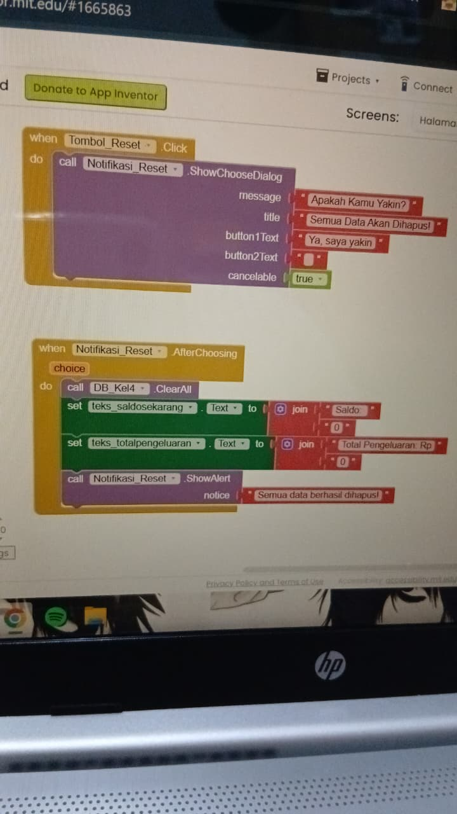

# Khansa - Panduan Perbaikan Logika Tombol Reset pada MIT App Inventor

Panduan ini dibuat untuk memperbaiki masalah tombol reset yang tetap menghapus data meskipun pengguna menekan tombol batal (cancel). Masalah ini terjadi karena semua perintah penghapusan langsung dijalankan tanpa memeriksa pilihan pengguna terlebih dahulu.

Ikuti instruksi detail di bawah ini untuk menambahkan blok pengkondisian agar data hanya terhapus jika siswa menekan tombol konfirmasi.

---

## Langkah-Langkah Perbaikan Blok Logika

### 1. Mengambil Blok Kondisi

- Buka laci **Control** berwarna **Cokelat** di sebelah kiri layar.
- Cari dan ambil blok bernama **if then**.
- Masukkan blok **if then** tersebut ke dalam blok utama **when Notifikasi_Reset .AfterChoosing**, tepat di bagian bawah tulisan **do**.

### 2. Mengambil Operator Perbandingan

- Buka laci **Logic** berwarna **Hijau Muda**.
- Cari dan ambil blok operator **=** (sama dengan).
- Pasangkan blok **=** ini ke dalam slot kosong di sebelah kanan kata **if** pada blok yang sudah kamu ambil sebelumnya.

### 3. Mengambil Variabel Pilihan Pengguna

- Arahkan kursor tetikus (mouse) kamu ke atas parameter **choice** yang berwarna **Oranye** pada bagian atas blok utama **when Notifikasi_Reset .AfterChoosing**. Jangan diklik, cukup arahkan saja hingga muncul menu pilihan baru.
- Ambil blok bernama **get choice** dari menu yang muncul tersebut.
- Pasangkan blok **get choice** ke dalam slot sebelah **kiri** dari operator **=** (sama dengan).

### 4. Membuat Teks Validasi

- Buka laci **Text** berwarna **Merah Muda**.
- Cari dan ambil blok teks kosong yang memiliki tanda petik dua **" "** (berada di urutan paling atas).
- Pasangkan blok teks kosong tersebut ke dalam slot sebelah **kanan** dari operator **=** (sama dengan).
- Ketikkan teks di dalam blok kosong tersebut dengan tulisan: **Ya, saya yakin** (Teks harus sama persis dengan button1Text pada komponen ShowChooseDialog, perhatikan penggunaan huruf kapital dan tanda bacanya).

### 5. Memindahkan Blok Eksekusi Data

- Ambil seluruh rangkaian blok yang saat ini berada di luar kondisi (blok **call DB_Kel4 .ClearAll**, blok **set teks_saldosekarang .Text**, blok **set teks_totalpengeluaran .Text**, dan blok **call Notifikasi_Reset .ShowAlert**).
- Pindahkan seluruh rangkaian blok tersebut dan masukkan ke dalam slot bagian **then** (di bawah baris if).

---

## Hasil Akhir Struktur Blok

Setelah mengikuti langkah-hari di atas, struktur blok logika kamu akan tersusun secara berurutan seperti ini dari atas ke bawah:

- **when Notifikasi_Reset .AfterChoosing** (Menerima parameter `choice`)
  - **do**
    - **if** [ **get choice** ] **=** [ **"Ya, saya yakin"** ]
    - **then**
      - **call DB_Kel4 .ClearAll**
      - **set teks_saldosekarang .Text to** -> **join** [ **"Saldo: "** ] [ **"0"** ]
      - **set teks_totalpengeluaran .Text to** -> **join** [ **"Total Pengeluaran: Rp "** ] [ **"0"** ]
      - **call Notifikasi_Reset .ShowAlert** (dengan notice: **"Semua data berhasil dihapus!"**)

Dengan susunan ini, apabila siswa menekan tombol batal atau keluar dari dialog konfirmasi, nilai dari variabel `choice` tidak akan sama dengan `"Ya, saya yakin"`. Akibatnya, perintah di dalam bagian `then` tidak akan dijalankan dan data di dalam database akan tetap aman.
